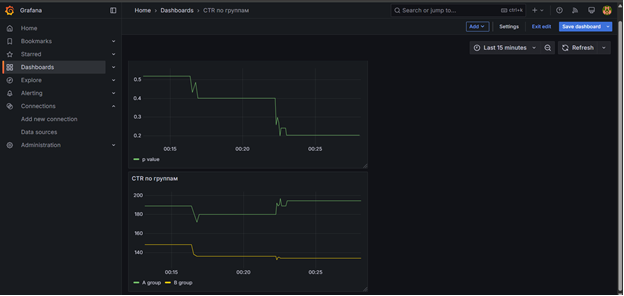

# A/B Тестирование с Django, Celery и MongoDB

## Описание проекта

Платформа для управления A/B тестами позволяет запускать эксперименты, распределять пользователей по группам, собирать данные и анализировать результаты в реальном времени. Интеграция с Grafana обеспечивает удобную визуализацию метрик.

---

## Возможности

- **Создание экспериментов** с гибким распределением групп (A/B/C...).
- **Автоматическое распределение** пользователей на основе хеширования.
- **Сбор событий** (клики, просмотры) в MongoDB.
- **Анализ результатов**: расчет CTR, конверсии, p-value.
- **Дашборды в Grafana** с автоматическим обновлением данных.
- **Масштабируемая архитектура** на базе Docker и Celery.

---

## Технологии

- **Backend**: Django, Django REST Framework.
- **Базы данных**: PostgreSQL (эксперименты, группы), MongoDB (события).
- **Асинхронные задачи**: Celery, Redis.
- **Визуализация**: Grafana.
- **Инфраструктура**: Docker, Nginx.

---

## Установка

1. Клонируйте репозиторий:

```bash
git clone https://github.com/SonderLor/ABTesting.git
cd ABTesting
```

2. Создайте файл переменных окружения `.env` с примерным содержанием:

```.env
# Django
SECRET_KEY=your-secret-key-here
DEBUG=True
ALLOWED_HOSTS=localhost,backend
CORS_ALLOWED_ORIGINS=http://localhost,http://127.0.0.1

# PostgreSQL
POSTGRES_DB=abtest
POSTGRES_USER=admin
POSTGRES_PASSWORD=secret
POSTGRES_HOST=postgres
POSTGRES_PORT=5432

# MongoDB
MONGO_HOST=mongo
MONGO_PORT=27017
MONGO_USER=admin
MONGO_PASSWORD=secret
MONGO_DB_NAME=abtest

# Redis (for Celery)
REDIS_HOST=redis
REDIS_PORT=6379
REDIS_DB=0

# Celery
CELERY_BROKER_URL=redis://redis:6379/0
CELERY_RESULT_BACKEND=redis://redis:6379/0

TIME_ZONE=Europe/Moscow
LANGUAGE_CODE=ru-ru
```

3. Запустите проект через Docker:

```bash
docker-compose up --build
```

4. Выполните миграции и создайте суперпользователя:

```bash
docker compose exec web python manage.py makemigrations
docker compose exec web python manage.py migrate
docker compose exec web python manage.py createsuperuser
```

5. Проверьте доступность сервисов:

- **Фронтенд**: `http://localhost/`
- **API**: `http://localhost/api/`
- **Админка Django**: `http://localhost/admin/` (ваш суперпользователь)
- **Grafana**: `http://localhost/grafana/` (логин: `admin`, пароль: `admin`)

---

## Пример использования

Создание эксперимента:

```bash
curl -X POST http://localhost/api/experiments/ \
     -H "Content-Type: application/json" \
     -d '{
         "name": "Button Color Test",
         "group_ratio": {"A": 50, "B": 50},
         "target_metrics": ["CTR"]
     }'
```

Получение группы пользователя:

```bash
curl http://localhost/api/experiments/1/assign-group/?user_id=user123
# Ответ: {"group": "A"}
```

---

## Дашборд в Grafana



*Пример дашборда с метриками CTR и p-value.*

## Звездуйте репозиторий, если проект вам понравился!

## Баги и предложения: [Issues](https://github.com/SonderLor/ABTesting/issues).